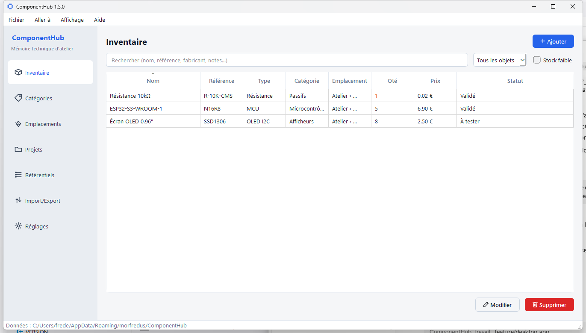
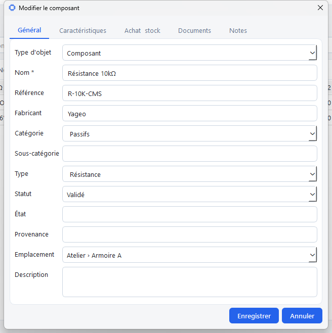
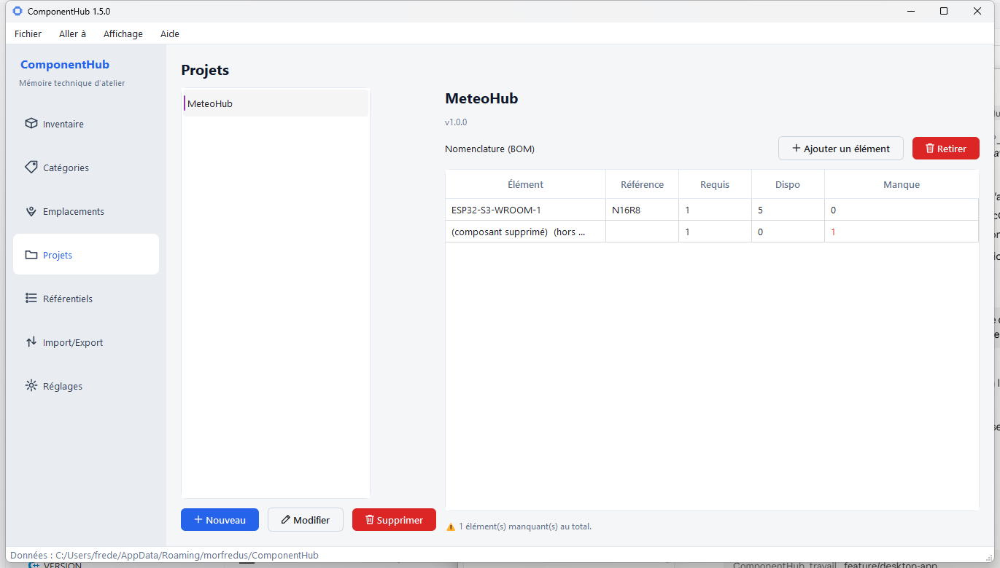
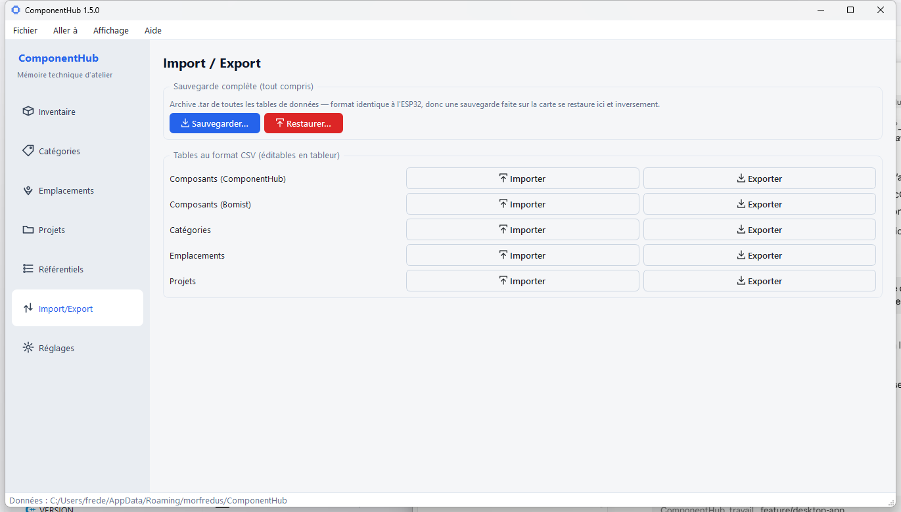

# ComponentHub

*Read in another language: **English** (this document) · [Français](README.fr.md).*


**The technical memory of an electronics workshop**: inventory of components,
modules, tools and consumables; stock and movements; hierarchical locations;
attached documentation; projects and their bill of materials.

This is more than a plain inventory: the goal is to find, in one click and for
any component, its stock, its physical location, its datasheets and the projects
that use it.



ComponentHub is a **Qt / C++17 desktop application**, native on **Windows, Linux
(x86_64) and Raspberry Pi (ARM64)**. It is the **master project**, the holder of
the workshop's reference database — on reliable storage, free of the ESP32's
memory limits. An **ESP32 firmware**, now developed in a **separate repository**
(`ComponentHub-ESP32`, a sibling of this one), becomes a **satellite**: a mobile
terminal to browse and update stock (QR scanning) that will eventually read the
desktop database. The rationale for this split is documented in
[docs/fr/ADR-0001](docs/fr/ADR-0001-desktop-maitre-esp32-satellite.md) *(FR)*.

## Get started in 3 minutes

Never compiled a program before? This is a good place to start — and it is
**exactly as simple on Linux/Raspberry Pi as on Windows** (often faster). Follow
the step-by-step guide:
**[docs/fr/GETTING_STARTED.md](docs/fr/GETTING_STARTED.md)** *(FR)*.

Once the app is running, the beginner's user manual is here:
**[docs/fr/USER_MANUAL.md](docs/fr/USER_MANUAL.md)** *(FR)*.

> **Documentation language.** By GitHub convention, the root files (this README,
> `CHANGELOG`, `ROADMAP`, `CONTRIBUTING`) are in English. The in-depth guides
> under `docs/` are currently written in **French only** — see
> [docs/en/README.md](docs/en/README.md) for an English index with links.

## Business core

The business core [`src/domain/`](src/domain/) — entities, services (inventory,
projects, documents, import/export), CSV — depends on neither Qt nor Arduino. The
ESP32 firmware keeps **its own copy** in its repository: the two projects, once
built on a shared core, now **evolve separately**. This layered separation
(domain ⟷ storage ⟷ UI) is described in
[docs/fr/ARCHITECTURE.md](docs/fr/ARCHITECTURE.md) *(FR)* and in
[CONTRIBUTING.md](CONTRIBUTING.md).

The desktop app stores each table as a JSON file and can back up the whole
workshop into a single `.tar` archive.

## Network supervision & updates

ComponentHub announces its presence on the local network and exposes live metrics
(**morfBeacon** module) so it can be watched from a central dashboard, and checks
GitHub for updates (**morfUpdate** module, from the Help menu). These shared
modules are vendored in the project (`third_party/morf/`) and compiled into the
binary — nothing external to install. See
[docs/fr/SUPERVISION_ET_MAJ.md](docs/fr/SUPERVISION_ET_MAJ.md) *(FR)*.

## LAN synchronization (offline-first)

ComponentHub can keep the same data across several machines through a lightweight
local-network hub, **HomeServerHub** — no cloud. The **local database stays
sovereign**: the app always works on its local copy; the hub only reconciles
copies when reachable. Set the hub address in **Settings → Synchronization**, then
sync automatically at startup, on demand, or when quitting (each toggleable), or
disable sync entirely with an explicit **local-only** mode. All tables sync with
referential integrity preserved, deletions propagate, and only changed entities
are sent (incremental). Identity is a per-entity **UUID** since 1.7. See
[docs/fr/SYNCHRONISATION.md](docs/fr/SYNCHRONISATION.md) *(FR)*.

> Upgrading from ≤ 1.6: identity moved from integer to UUID. Start from a fresh
> database and re-import your data (Bomist or native CSV).

## Overview

**Component sheet** — everything about a component (general, characteristics,
purchase/stock, documents, notes):



**Projects** — bill of materials (BOM) and computation of missing components:



**Import / Export** — full `.tar` backup and per-table CSV:



## Building (desktop)

Dependencies: CMake ≥ 3.21, a C++17 compiler, Ninja, **Qt 6 (Widgets)**,
**nlohmann-json**. Detailed, beginner-friendly walkthrough:
[docs/fr/GETTING_STARTED.md](docs/fr/GETTING_STARTED.md) *(FR)*; multi-platform
reference: [docs/fr/BUILD_DESKTOP.md](docs/fr/BUILD_DESKTOP.md) *(FR)*.

### Windows (MSYS2 / MinGW)

```sh
cmake --preset mingw
cmake --build --preset mingw
# -> build-mingw/ComponentHub.exe (Qt + MinGW DLLs deployed automatically)
```

In VS Code, the **CMake: Build (MinGW)** and **ComponentHub: Run** tasks
(`.vscode/tasks.json`) do the same in one shortcut.

### Linux (x86_64) / Raspberry Pi (ARM64)

```sh
cmake --preset linux        # or linux-arm64 on Raspberry Pi
cmake --build --preset linux
```

## Distributable packages

Packaging scripts live in `scripts/`:

```sh
# Windows: self-contained ZIP (exe + DLLs + Qt plugins)
powershell -ExecutionPolicy Bypass -File scripts\windows\package-win.ps1

# Linux: Debian package (.deb, linked to the system Qt)
scripts/linux/package-deb.sh

# Linux: self-contained AppImage (bundled Qt)
scripts/linux/package-appimage.sh

# Linux: desktop menu integration (already-built binary)
scripts/linux/install.sh
```

Artifacts are produced in `dist/`.

## Repository layout

```
ComponentHub/
├── CMakeLists.txt          desktop application (main target)
├── CMakePresets.json       presets: mingw / linux / linux-arm64 / cross
├── cmake/toolchains/       ARM64 cross-compilation toolchain
├── scripts/{windows,linux}/ VS Code build + packaging (zip, deb, AppImage)
├── resources/              app.qrc, themes (light/dark), icon (logo.png, app.ico)
├── src/
│   ├── domain/             business core (no Qt/Arduino dependency)
│   ├── ui/                 Qt interface (Theme, Icons, pages, dialogs)
│   ├── storage/            JSON file repositories (desktop)
│   ├── platform/           .tar archive, clock
│   └── main.cpp
├── docs/
│   ├── fr/                 documentation (French, reference language)
│   ├── en/                 English index (points to fr/ for now)
│   └── pictures/           screenshots
├── CONTRIBUTING.md         project philosophy and contribution rules
├── VERSION                 desktop application version
└── LICENSE
```

> The ESP32 firmware lives in a separate repository (`ComponentHub-ESP32`) and is
> no longer included here.

## Documentation

| Document | Contents |
|---|---|
| [docs/fr/GETTING_STARTED.md](docs/fr/GETTING_STARTED.md) *(FR)* | Clone, install the tools, build and run — step by step, every OS, beginners included |
| [docs/fr/USER_MANUAL.md](docs/fr/USER_MANUAL.md) *(FR)* | Application user manual, to get productive quickly |
| [docs/fr/BUILD_DESKTOP.md](docs/fr/BUILD_DESKTOP.md) *(FR)* | Multi-platform build reference |
| [docs/fr/ARCHITECTURE.md](docs/fr/ARCHITECTURE.md) *(FR)* | Layered architecture (domain / storage / UI) |
| [docs/fr/SUPERVISION_ET_MAJ.md](docs/fr/SUPERVISION_ET_MAJ.md) *(FR)* | LAN supervision (presence + metrics) and update checking |
| [docs/fr/SYNCHRONISATION.md](docs/fr/SYNCHRONISATION.md) *(FR)* | LAN synchronization with HomeServerHub (offline-first) |
| [docs/fr/ADR-0001](docs/fr/ADR-0001-desktop-maitre-esp32-satellite.md) *(FR)* | Decision: desktop master, ESP32 satellite |
| [CONTRIBUTING.md](CONTRIBUTING.md) | How to contribute, portability rules |
| [CHANGELOG.md](CHANGELOG.md) | Version history |
| [docs/en/README.md](docs/en/README.md) | English documentation index |

> The firmware-specific documentation (embedded architecture, REST API, WiFi,
> boot log) lives in the `ComponentHub-ESP32` repository.

## License

Distributed under the [GPL-3.0-only license](LICENSE).
