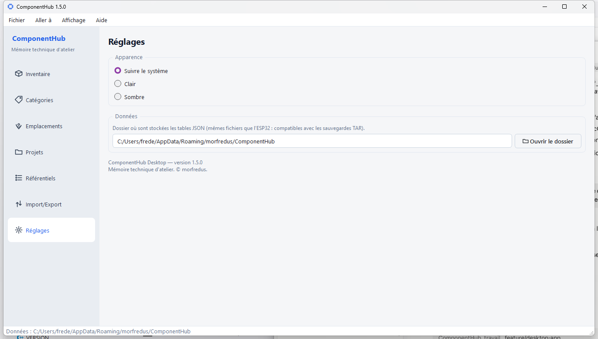

# Mode d'emploi — ComponentHub

Ce guide explique **comment utiliser ComponentHub au quotidien**, sans rien
supposer de connu. Pour l'installer/compiler, voir
[GETTING_STARTED.md](GETTING_STARTED.md).

ComponentHub est la **mémoire technique de votre atelier** : chaque composant,
module, outil ou consommable y a une fiche, avec son stock, son emplacement, sa
documentation et les projets qui l'utilisent.

---

## 1. Premier lancement

Au démarrage, l'application ouvre (ou crée) votre **dossier de données
personnel** : c'est là que tout est enregistré, automatiquement, à chaque
modification. Vous n'avez jamais à « sauvegarder un fichier » manuellement.

Le chemin exact est rappelé **en bas de la fenêtre** et dans *Réglages*. Par
défaut (remplacez `<compte>` par votre nom d'utilisateur) :

- **Windows** : `C:\Users\<compte>\AppData\Roaming\morfredus\ComponentHub`
  (soit `%APPDATA%\morfredus\ComponentHub`)
- **Linux / Raspberry Pi** : `/home/<compte>/.local/share/morfredus/ComponentHub`
  (soit `~/.local/share/morfredus/ComponentHub`)

> `<compte>` est **votre** nom d'utilisateur (propre à votre session) ;
> `morfredus` est le dossier de **l'éditeur** de l'application — identique sur
> toutes les machines.

Le plus simple : **Fichier → Ouvrir le dossier de données** vous y emmène
directement, quel que soit votre système.

---

## 2. Le tour de la fenêtre

- **La barre latérale** (à gauche) : les sections de l'application. Cliquez pour
  changer d'écran.
- **La barre de menus** (en haut) : *Fichier*, *Aller à*, *Affichage*, *Aide* —
  les mêmes accès qu'à gauche, plus le thème, l'aide et « À propos ».
- **La barre de statut** (en bas) : le chemin de votre dossier de données.

Les sept sections : **Inventaire**, **Catégories**, **Emplacements**,
**Projets**, **Référentiels**, **Import/Export**, **Réglages**.

---

## 3. Inventaire — le cœur de l'outil

C'est la liste de tout ce que vous possédez. Chaque ligne est un composant, un
module, un outil ou un consommable.

### Ajouter un article

1. Cliquez sur **+ Ajouter** (en haut à droite).
2. Remplissez la **fiche** (voir ci-dessous). Seul le **Nom** est obligatoire.
3. **Enregistrer**.

### La fiche composant

La fiche est organisée en **onglets** :

- **Général** : type d'objet (composant / module / outil / consommable), nom,
  référence, fabricant, catégorie, type, statut, **emplacement**, description.
- **Caractéristiques** : caractéristiques techniques, interface (I2C, SPI…).
- **Achat / stock** : quantité, seuil d'alerte de stock faible, prix,
  fournisseur, dates.
- **Documents** : datasheets, PDF, liens rattachés à l'article.
- **Notes** : vos remarques libres.

Astuce : si vous saisissez un **type** ou une **catégorie** qui n'existe pas
encore, l'application propose de le créer à la volée.

### Rechercher et filtrer

- **La barre de recherche** balaie **tous** les champs texte à la fois
  (nom, référence, fabricant, caractéristiques, notes…). Tapez plusieurs mots :
  ils sont tous exigés (ET logique).
- Le menu déroulant **Tous les objets** filtre par famille ; la case **Stock
  faible** n'affiche que ce qui est sous le seuil d'alerte.
- Cliquez sur un **en-tête de colonne** pour trier (Qté et Prix sont triés
  numériquement, pas alphabétiquement).

### Modifier / supprimer

Sélectionnez une ligne, puis **Modifier** ou **Supprimer** (en bas à droite).
Double-cliquer sur une ligne ouvre aussi sa fiche.

### Mouvements de stock

Depuis la fiche, vous enregistrez des **entrées / sorties / corrections** de
stock. L'application tient l'**historique** et met à jour la quantité ; quand
elle passe sous votre seuil, l'article apparaît en **stock faible**.

---

## 4. Catégories

La liste des catégories de composants (Passifs, MCU, Afficheurs…). Vous pouvez
les gérer ici ; une catégorie inconnue saisie dans une fiche est créée
automatiquement.

## 5. Emplacements

Vos rangements, **organisés en arborescence** : par exemple *Atelier → Armoire A
→ Tiroir A12*. Boutons **Ajouter (racine)**, **Ajouter un enfant** (sous
l'élément sélectionné), **Renommer**, **Supprimer**. Dans une fiche composant,
le champ *Emplacement* propose ces chemins.

## 6. Projets

Un **projet** regroupe les composants dont il a besoin (sa **nomenclature** ou
« BOM »). Pour chaque ligne, l'application affiche **Requis / Dispo / Manque** en
comparant au stock réel, et totalise ce qu'il **reste à acheter**.

Une ligne peut être :

- un **composant de l'inventaire** (suivi du stock réel), ou
- un **élément hors inventaire** (nom libre, toujours « à acheter ») pour
  quelque chose que vous ne possédez pas encore.

## 7. Référentiels

Des **listes de valeurs normalisées** (types de composants, fabricants, boîtiers,
fournisseurs, technologies, états, mots-clés) pour éviter les doublons du genre
« Capteur / Capteurs / Sensor ». Par liste : ajouter, renommer, supprimer,
réordonner, **fusionner** deux doublons, importer/exporter en CSV. Renommer ou
fusionner une valeur **met à jour les composants** qui l'utilisent.

## 8. Import / Export — et surtout, vos **sauvegardes**

Deux usages :

### Sauvegarde complète (recommandé)

Le bouton **Sauvegarder…** crée une archive **`.tar`** contenant **tout** votre
atelier (toutes les tables **et** les fichiers joints). **Restaurer…** recharge
une telle archive. C'est **la** façon de mettre vos données à l'abri (copiez le
`.tar` sur une clé, un NAS…) ou de les transférer sur une autre machine.

### Import / export CSV par table

Pour échanger avec un tableur : composants (format ComponentHub natif ou
compatible Bomist), catégories, emplacements, projets. Les CSV sont en UTF-8
(les accents et le « € » s'affichent correctement dans Excel/LibreOffice).

---

## 9. Réglages

- **Apparence** : thème **Suivre le système / Clair / Sombre** (aussi accessible
  par le menu *Affichage → Thème*).
- **Données** : le chemin de votre dossier, avec un bouton **Ouvrir le dossier**.
- En bas : la **version** de l'application.

---

## 10. Menus et raccourcis clavier

| Raccourci | Action |
|---|---|
| **Ctrl+1** … **Ctrl+7** | Aller directement à une section |
| **F1** | Ouvrir l'aide (« Bien démarrer ») |
| **Ctrl+Q** | Quitter |

Menu **Aide → À propos** : version de l'application, version de Qt, licence.

---

## 11. À retenir

- Vos données sont **enregistrées automatiquement** dans votre dossier personnel.
- Faites régulièrement une **sauvegarde `.tar`** (Import/Export → Sauvegarder…)
  et rangez-la ailleurs que sur l'ordinateur.
- Le **Nom** est le seul champ obligatoire d'une fiche : commencez simple,
  complétez plus tard.

Bonne organisation d'atelier ! Pour toute question technique ou pour contribuer,
voir [CONTRIBUTING.md](../../CONTRIBUTING.md).
